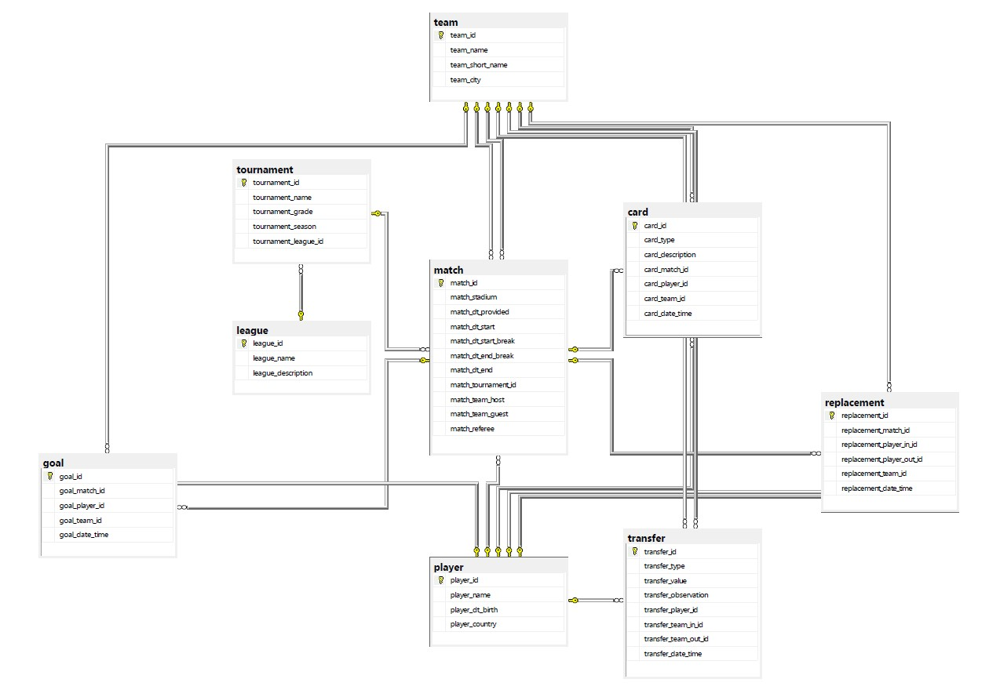
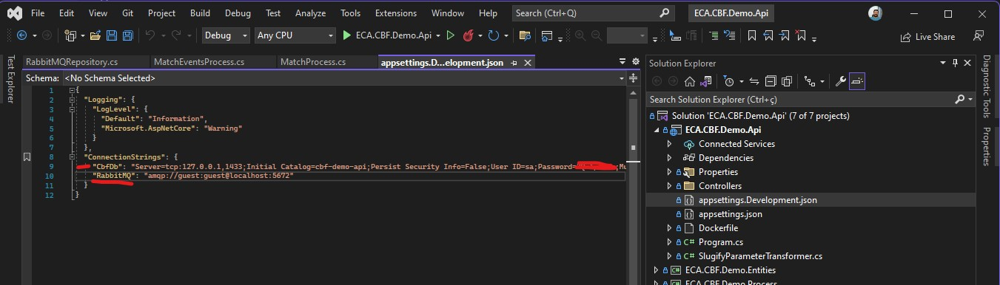
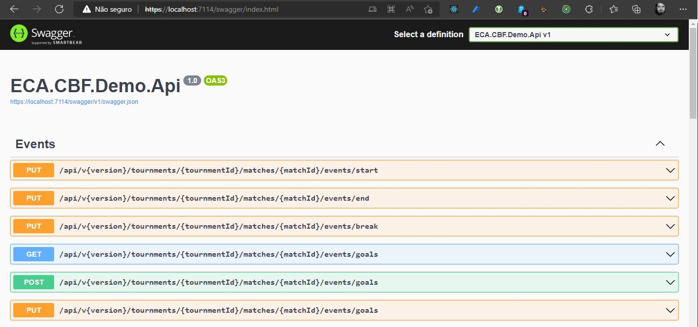
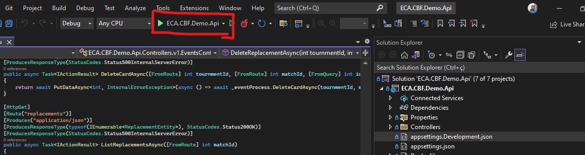

<p align="center">
  <h1 align="center">CBF Demo Api</h1>
  <p align="center">
    01/2022 - APIs e Web Services - Trabalho Final  
  </p>
  <p align="center">
  Trabalho final apresentado para a disciplina APIs e Web Services (AWS)
  </p>
    <p align="center">
  Elias da Cunha Alves (14017088)
  </p>
</p>

________________

<br />


## Sobre a aplicação

Foi desenvolvida uma API que possibilita o gerenciamento de pequenas ligas de futebol. É possível cadastrar vários Times e seus Jogadores, bem como as transferências realizadas entre times. Também é possível cadastrar campeonatos e programar a execução de partidas entre times. Para as partidas cadastradas é possível lançar cartões (advertências), gols, substituições, bem como início e fim das partidas e do intervalo. Quando buscamos os dados das partidas todos os dados dos eventos referentes a essas partidas são informados.

### Camadas e responsabilidade (MVP)
O projeto foi estruturado como um MVC. Possui as camadas repositório(M), processo(V) e controller(C). Os processos implementam interfaces IProcesso e os repositórios IRepositorio, para facilitar o desenvolvimento de testes unitários.

```text
  API
  | ^
  | |  HTTP
  v |
Controller
  | ^
  | |  Data transfer objects (ex AtividadeEquipagemDto)
  v |
Processo:IProcesso <--> Mocks de processo
  | ^
  | |  Entidades (ex AtividadeEquipagemBd)
  v |
Repositorio:IRepositorio <--> Mocks de repositório
  | ^
  | |  SQL
  v |
Banco de dados
```

Nos controllers estão definidos os endpoints da API. Um controller usa um ou mais processos.
Nos processos estão definidas as regras de negócio que utilizam dados de um ou mais repositórios.
Nos repositórios estão definidas as queries que as preenchem. As queries preenchem entidades, classes que representam no código um dado vindo do banco de dados

### Modelo de dados


### Principais Tecnologias

A API está integrada a um serviço de filas que disponibiliza mensagens com os dados de atualização das partidas toda vez que algum evento é registrado ou caso uma partida seja atualizada.
O .NET 6.0 foi usado para desenvolver a API e uma fila baseada em RabbitMQ rodando em contêiner Docker. SQL Server foi escolhido como banco de dados, para o qual desenvolvemos um modelo relacional.

- [.NET 6.0](https://dotnet.microsoft.com/)
- [RabbitMQ](https://www.rabbitmq.com/)
- [Docker](https://www.docker.com/)
- [Visual Studio Community](https://visualstudio.microsoft.com/pt-br/vs/community/)
- [Visual Studio Code](https://code.visualstudio.com/)

### Pré-Requisitos

- [.NET 6.0](https://dotnet.microsoft.com/) instaldo e configurado.
- Banco de dados rodando e configurado [Script de inicialização do banco de dados](./.assets/init-db.sql)
- Docker configurado na máquina
- RabbitMQ rodando e configurado

As configurações necessárias para conectar a API aos serviços de banco de dados e mensageria estão localizadas no arquivo appsettings.Development.json.




### Como rodar

Primeiro é necessário clonar esse repositório em seu computador local.

- Clonando repositório

  ```sh
  git clone https://github.com/unixelias/ECA.CBF.Demo.Api.git
  cd ECA.CBF.Demo.Api
  ```

As configurações de acesso ao RabbitMQ estão setadas para o padrão guest:guest.

- Iniciando RabbitMQ

  ```sh
  docker run -d --rm --hostname my-rabbit --name some-rabbit -p 8080:15672 -p 5672:5672 -p 5671:5671 rabbitmq:3-management
  ```

 Em seguida, tendo os serviços de banco de dados rodando, bem como os dados de conexão ao servidor RabbitMQ configurados na aplicação, basta usar o dotnet para iniciar a aplicação, conforme segue:

- Utilizando o dotnet

  ```sh
  dotnet restore ECA.CBF.Demo.Api.sln
  dotnet run --project ECA.CBF.Demo.Api/ECA.CBF.Demo.Api.csproj
  ```

Ao iniciar a aplicação é disponibilizada uma interface baseada em Swagger. Essa interface é baseada em OpenApi 3.0 e pode ser usada para tesar os endpoints disponibilizados, contendo ainda os contratos usados nos endpoints com exemplos.



### Rodando com Visual Studio

A maneira mais fácil de rodar esse projeto é pelo Visual Studio, que é o SDK do .NET. Basta abrir o arquivo **ECA.CBF.Demo.Api.sln**.
Ao abrir o projeto, você pode 




## Vídeo demo

[Link para o video de demonstração](https://www.youtube.com/watch?v=6hxCfwUrF0k)


## Licença

MIT License.
